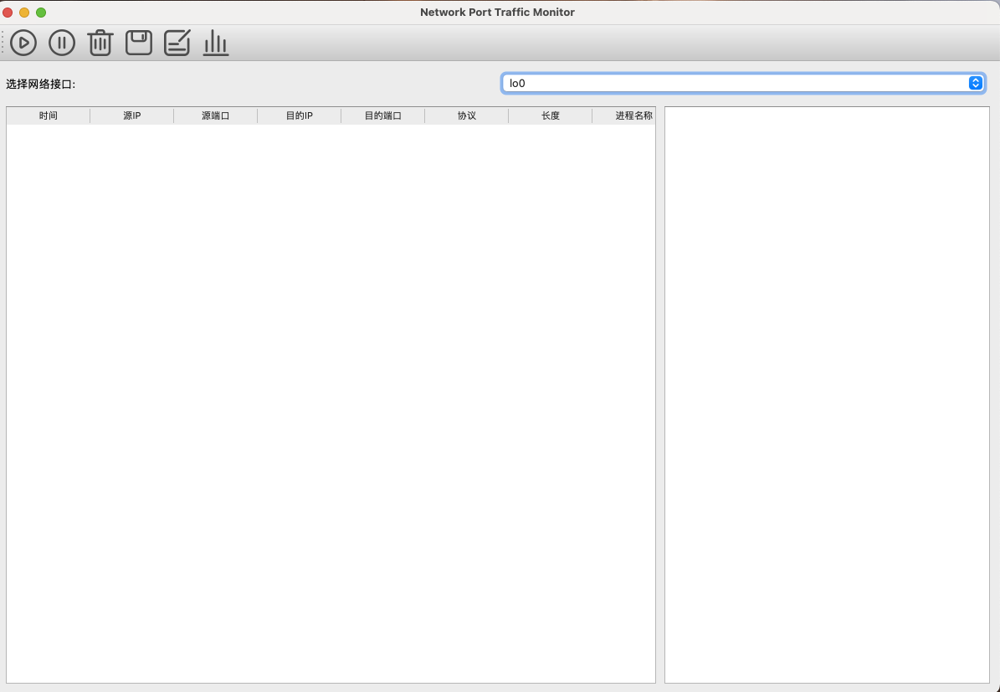
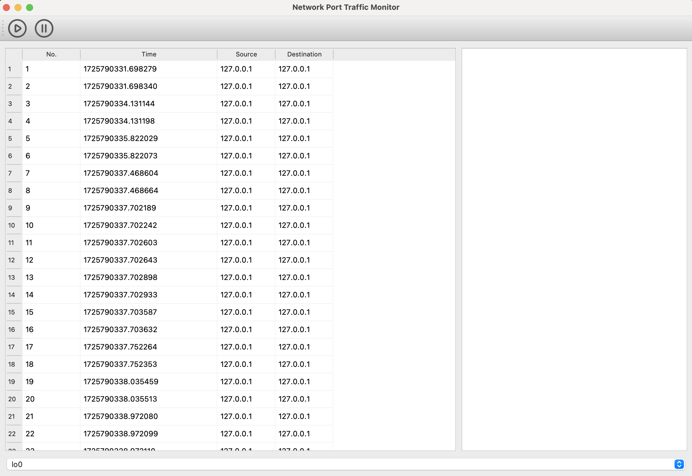
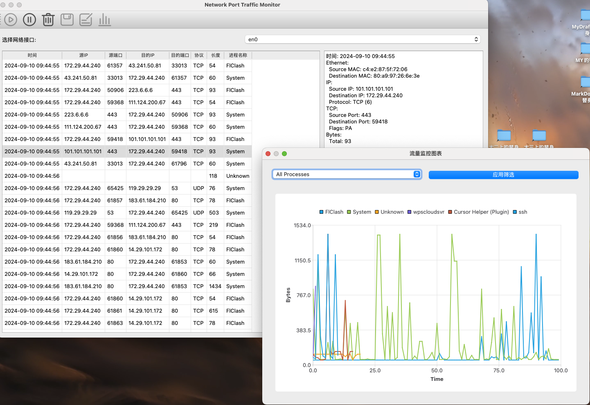
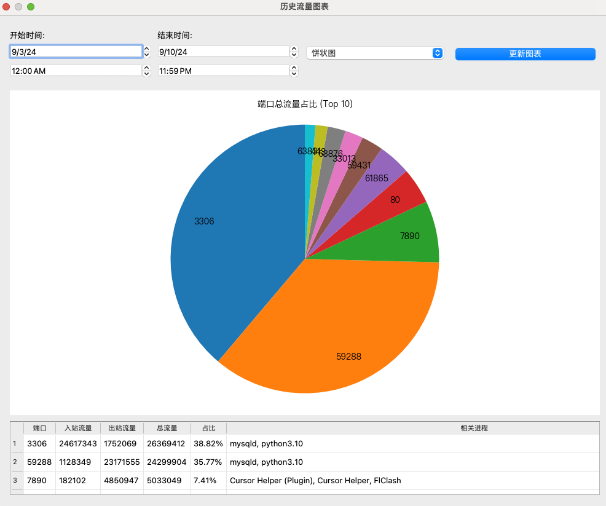
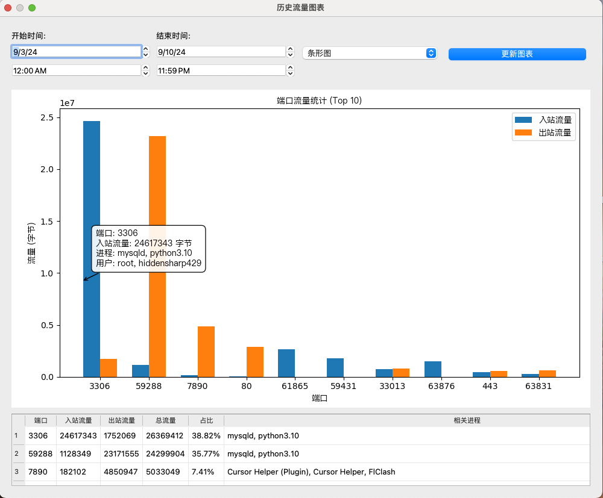

<!--
 * @Author: SheathedSharp429 z404878860@163.com
 * @Date: 2024-09-10 09:36:11
-->
<div align="center">
  
  [](https://github.com/SheathedSharp429/Network-Port-Traffic-Monitoring-System/blob/main/Readme_CN.md)    |  [](https://github.com/SheathedSharp429/Network-Port-Traffic-Monitoring-System/blob/main/Readme.md)) 
  
</div>

# Network Port Traffic Monitoring System

## Introduction

This system is a network port traffic monitoring tool based on Python and PyQt5. It can capture and analyze network packets in real-time, providing detailed traffic statistics and visual reports.

## Features

1. **Real-time Capture**: Capable of capturing network packets in real-time and performing real-time analysis.
2. **Traffic Statistics**: Provides detailed traffic statistics, including packet count, traffic size, etc.
3. **Visual Reports**: Generates detailed traffic statistics reports and provides visual charts for display.
4. **User-friendly Interface**: Developed using PyQt5, the interface is simple, intuitive, and easy to operate.

## Installation and Usage

1. **Install Dependencies**:
    Using `pip`:
    ```bash
    pip install -r requirements.txt
    ```

    Or using `conda`:
    ```bash
    conda install --file requirements.txt
    ```

2. **Run the Program**:
    On macOS, you need to run the program with `sudo` privileges:
    ```bash
    sudo python main.py
    ```

    On Windows, run the program directly:
    ```bash
    python main.py
    ```

## Database Configuration
In order to use the database, you need to configure the database first.
### Database Setup
1. The system uses MySQL for data persistence and historical analysis
2. Create a new MySQL database and execute the following SQL:
```SQL
CREATE TABLE capture_sessions (
  id INT AUTO_INCREMENT PRIMARY KEY,
  start_time DATETIME,
  end_time DATETIME
);

CREATE TABLE packets (
  id INT AUTO_INCREMENT PRIMARY KEY,
  session_id INT,
  packet_data JSON,
  capture_time DATETIME,
  FOREIGN KEY (session_id) REFERENCES capture_sessions(id)
);
```

### Database Settings
1. Access database settings through the toolbar settings icon
2. Configure the following parameters:
   - Host: MySQL server address
   - Port: MySQL server port (default 3306)
   - Database: Database name
   - Username: MySQL username
   - Password: MySQL password

### Database Features
1. **Data Persistence**
   - Automatically saves captured packet information
   - Stores detailed packet metadata in JSON format
   - Maintains capture session history

2. **Historical Analysis**
   - View historical traffic patterns
   - Generate traffic statistics by time period
   - Compare traffic across different capture sessions

3. **Data Security**
   - Encrypted database credentials storage
   - Secure connection handling
   - Password protection for sensitive data

### Usage Examples
1. **View Historical Data**
   - Click the "Historical Chart" button in the toolbar
   - Select date range for analysis
   - Choose specific processes or view all traffic

2. **Export Data**
   - Export captured data to CSV/JSON format
   - Generate custom reports from historical data
   - Backup capture sessions for later analysis

## Notes
1. Administrator privileges are required to capture network packets.

## Contact Us
Feel free to contact us:
- Email: z404878860@163.com

## Screenshots





