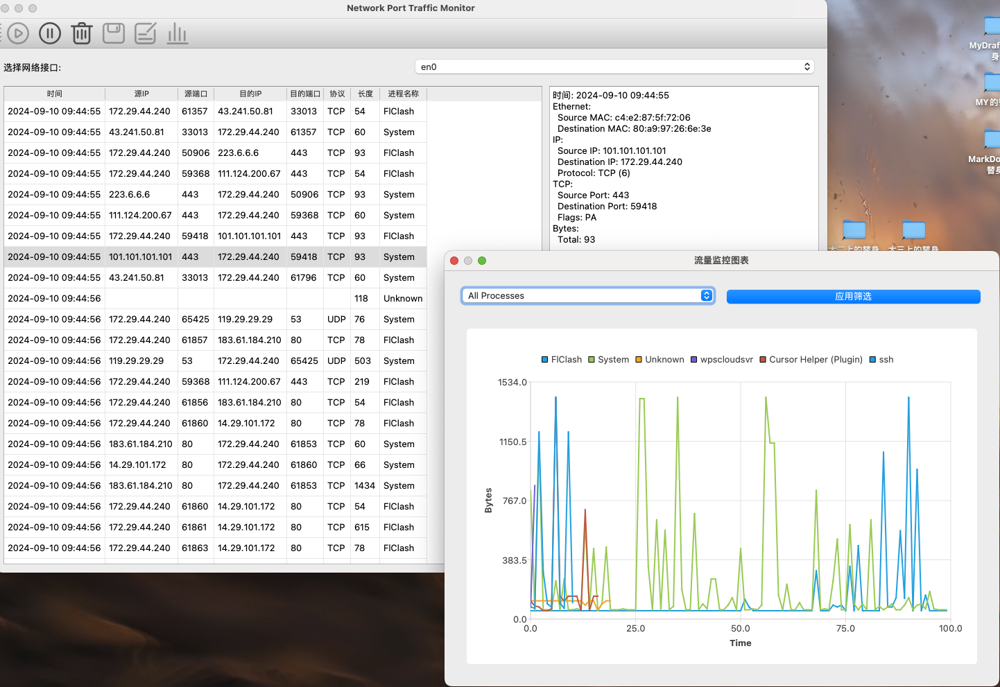

<div align="center">

  [](https://github.com/hiddenSharp429/Network-Port-Traffic-Monitoring-System/blob/main/Readme_CN.md)    |  [](https://github.com/hiddenSharp429/Network-Port-Traffic-Monitoring-System/blob/main/Readme.md)) 
  
</div>

# 网络端口流量监控系统

## 简介

本系统是一款基于Python和PyQt5的网络端口流量监控工具。它能够实时捕获和分析网络数据包，提供详细的流量统计和可视化报告。

## 功能特点

1. **实时捕获**：能够实时捕获网络数据包，并进行实时分析。
2. **流量统计**：提供详细的流量统计信息，包括数据包数量、流量大小等。
3. **可视化报告**：生成详细的流量统计报告，并提供可视化图表展示。
4. **用户友好的界面**：使用PyQt5开发，界面简洁直观，易于操作。

## 安装与使用

1. **安装依赖**：
    使用 `pip`：
    ```bash
    pip install -r requirements.txt
    ```

    或者使用 `conda`：
    ```bash
    conda install --file requirements.txt
    ```

2. **运行程序**：
    在MacOS系统中，需要使用 `sudo` 权限运行程序：
    ```bash
    sudo python main.py
    ```

    在Windows系统中，直接运行程序：
    ```bash
    python main.py
    ```

## 数据库配置
在该项目中会用到本地的数据库，为了正常使用该软件，需要先进行数据库相关的配置。
### 数据库设置
1. 系统使用 MySQL 进行数据持久化和历史分析
2. 创建新的 MySQL 数据库并执行以下 SQL:
```SQL
CREATE TABLE capture_sessions (
  id INT AUTO_INCREMENT PRIMARY KEY,
  start_time DATETIME,
  end_time DATETIME
);

CREATE TABLE packets (
  id INT AUTO_INCREMENT PRIMARY KEY,
  session_id INT,
  packet_data JSON,
  capture_time DATETIME,
  FOREIGN KEY (session_id) REFERENCES capture_sessions(id)
);
```

### 数据库配置
1. 通过工具栏设置图标访问数据库设置
2. 配置以下参数:
   - 主机: MySQL 服务器地址
   - 端口: MySQL 服务器端口(默认 3306)
   - 数据库: 数据库名称
   - 用户名: MySQL 用户名
   - 密码: MySQL 密码

### 数据库功能
1. **数据持久化**
   - 自动保存捕获的数据包信息
   - 以 JSON 格式存储详细的数据包元数据
   - 维护捕获会话历史记录

2. **历史分析**
   - 查看历史流量模式
   - 按时间段生成流量统计
   - 比较不同捕获会话的流量

3. **数据安全**
   - 加密存储数据库凭据
   - 安全的连接处理
   - 敏感数据密码保护

### 使用示例
1. **查看历史数据**
   - 点击工具栏中的"历史图表"按钮
   - 选择分析的日期范围
   - 选择特定进程或查看所有流量

2. **导出数据**
   - 将捕获的数据导出为 CSV/JSON 格式
   - 从历史数据生成自定义报告
   - 备份捕获会话以供后续分析

## 注意事项
1. 需要管理员权限才能捕获网络数据包。

## 联系我们
欢迎联系我们：
- 邮箱：z404878860@163.com

## 页面展示




