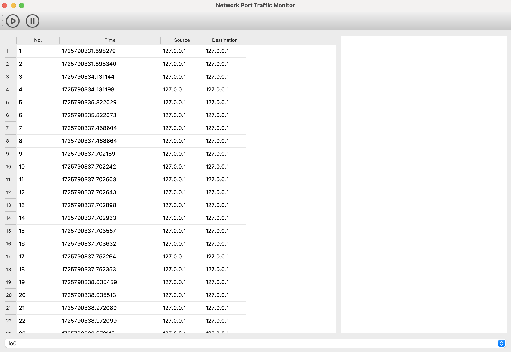

<div align="center">
  
  [](https://github.com/hiddenSharp429/Network-Port-Traffic-Monitoring-System/blob/main/Readme_CN.md)    |  [](https://github.com/hiddenSharp429/Network-Port-Traffic-Monitoring-System/blob/main/Readme.md)) 
  
</div>

# 网络端口流量监控系统

## 简介

本系统是一款基于Python和PyQt5的网络端口流量监控工具。它能够实时捕获和分析网络数据包，提供详细的流量统计和可视化报告。

## 功能特点

1. **实时捕获**：能够实时捕获网络数据包，并进行实时分析。
2. **流量统计**：提供详细的流量统计信息，包括数据包数量、流量大小等。
3. **可视化报告**：生成详细的流量统计报告，并提供可视化图表展示。
4. **用户友好的界面**：使用PyQt5开发，界面简洁直观，易于操作。

## 安装与使用

1. **安装依赖**：
    使用 `pip`：
    ```bash
    pip install -r requirements.txt
    ```

    或者使用 `conda`：
    ```bash
    conda install --file requirements.txt
    ```

2. **运行程序**：
    在MacOS系统中，需要使用 `sudo` 权限运行程序：
    ```bash
    sudo python main.py
    ```

    在Windows系统中，直接运行程序：
    ```bash
    python main.py
    ```

## 注意事项
1. 需要管理员权限才能捕获网络数据包。

## 联系我们
欢迎联系我们：
- 邮箱：z404878860@163.com

## 页面展示





